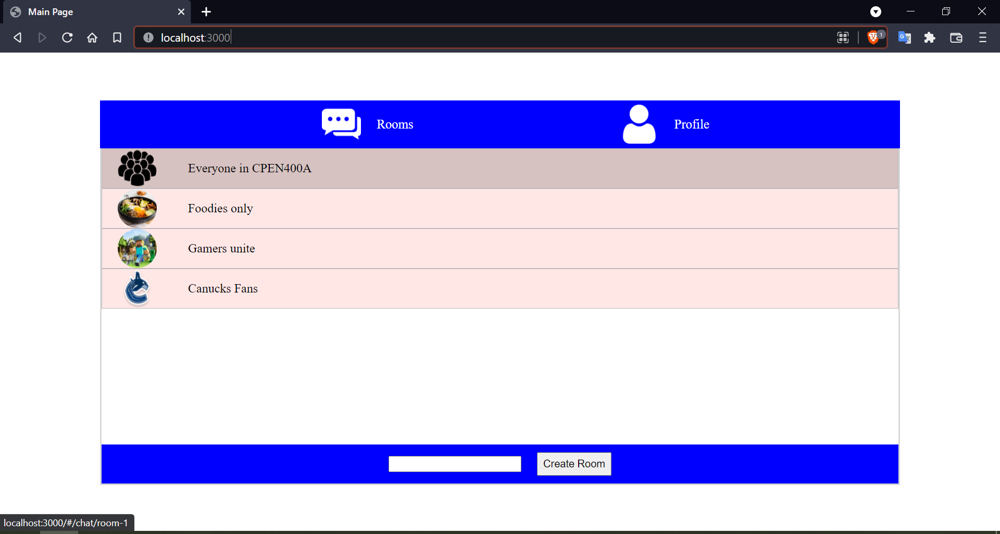
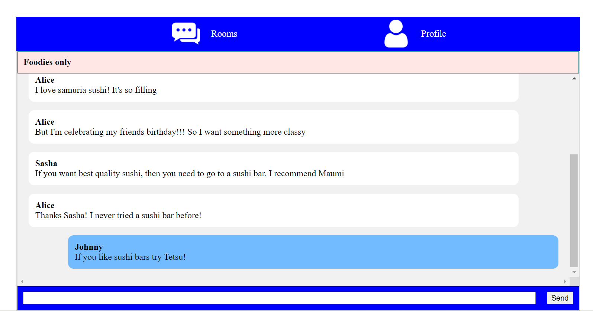
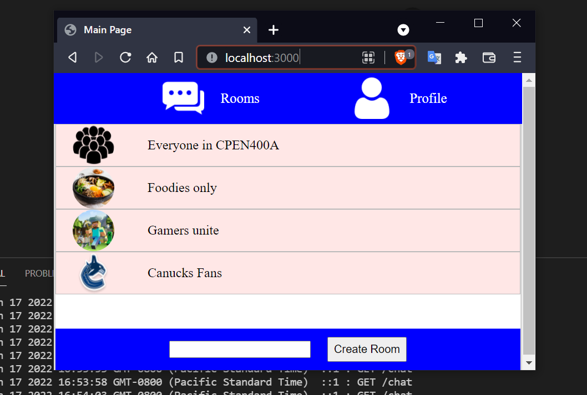
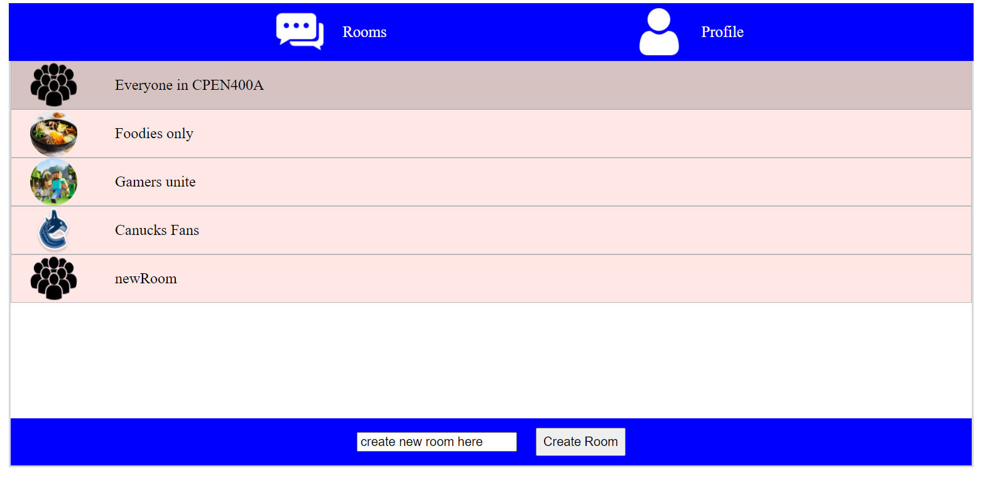
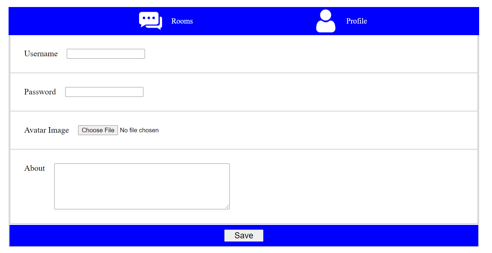

# CPEN400A Group Chat Progressive Web App Project

A Clone of Repository for CPEN400A Group Chat Progressive Web App Project
 
# Written in Javascript, HTML, CSS. Backend uses Node.js, Express.js, Websockets and Mongodb NOSQL database
 
## Images
 
### Main menu:
 
 
### Chat view:
 

### Ensure app still works when resized:
 

### Add new room:
 

### Edit Profile:
 

